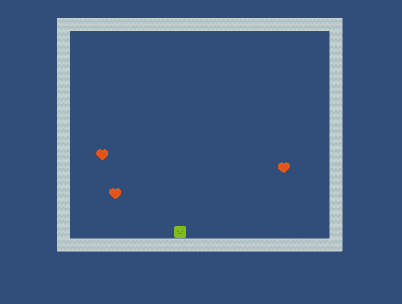

# snakeUnity
The game "Snake" on the Unity 2019 engine. NN-Model testing.
Uses visual camera input for multi-agents.

Dependencies:
ml-agents==0.14.0 

How learn model?!

Importing the ML-Agents assets to project, rebuild. [[Documentation]( https://github.com/Unity-Technologies/ml-agents/blob/master/docs/Learning-Environment-Create-New.md )]

In command line:
 
mlagents-learn config/config.yaml --run-id=snake-1 --train

and Run scene, Wait for the end of training.

Associate the resulting model file with the "Model" property of the HeadAgent prefab object.

Result:

